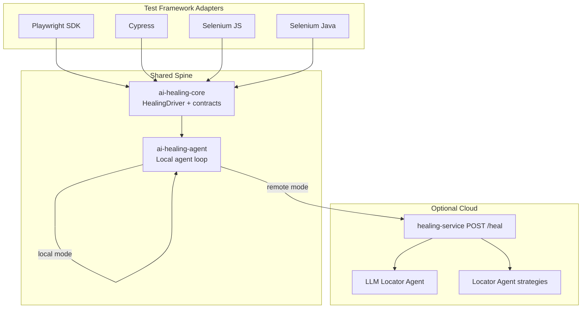

# Agentic Multi-Framework Test Healing — Executive Brief

**Audience:** CTO, AI Director  
**Product:** Agentic Healing Platform (`agentic-healing-platform`)  
**Repos:** [agentic-healing-platform](https://github.com/mmohansqaai/agentic-healing-platform) · [ai-healing-sdk](https://github.com/mmohansqaai/ai-healing-sdk)

---

## 1. Executive summary

We built a **framework-agnostic, agentic self-healing layer** for UI test automation. When a locator breaks (UI change, flaky selector, deploy drift), an **AI agent** observes the page, proposes replacement locators, validates them, and retries — often without human intervention.

**Key message for leadership:** One healing brain, many test frameworks, two deployment modes (embedded local agent or cloud SaaS via `healing-service`).

---

## 2. Problem we solve

| Pain | Without healing | With agentic healing |
|------|-----------------|----------------------|
| Locator breakage | Test fails → manual triage → fix selector → re-run | Test self-recovers in-run |
| Cross-team frameworks | Each stack reinvents recovery | Shared contracts + adapters |
| AI investment | LLM demos disconnected from CI | Agent loop wired to real test runs |
| SaaS path | N/A | Same `POST /heal` API billable per request |

**ROI narrative:** Reduce flaky-failure toil, shorten release feedback loops, and productize healing as a platform service.

---

## 3. Architecture (one brain, many drivers)



---

## 4. Multi-framework coverage (current)

| Framework | Package | Local agent (no server) | Cloud agent (LLM) | Plug-and-play API |
|-----------|---------|------------------------|-------------------|-------------------|
| **Playwright** | `ai-healing-sdk` | ✅ Full | ✅ | `enableHealing(page)` + `healable.*` |
| **Cypress** | `ai-healing-cypress` | ✅ **Now parity** | ✅ | `enableHealing()` + `healable.*` |
| **Selenium (JS)** | `ai-healing-selenium` | ✅ **Now parity** | ✅ | `enableHealing(driver)` + `healable.*` |
| **Selenium (Java)** | `ai-healing-java` | ⚠️ Remote today | ✅ | `HealingContext.enable()` + `Healable.*` |

**Parity update:** Cypress and Selenium JS now use the shared **`ai-healing-agent`** package — same observe → tool use → validate → reflect loop as Playwright, **without requiring `healing-service`**.

---

## 5. What “agentic” means (for AI Director)

Each healing cycle follows an **agent loop**, not a static fallback list:

1. **Observe** — Capture URL, title, structured DOM inventory (`domSnapshot`)
2. **Reason** — Agent tools: seed heuristics, DOM scan synthesis, hint-based search
3. **Act** — Validate candidate locators on live browser (`count`, `click`, `fill`, `isVisible`)
4. **Reflect** — Record failures, exclude bad candidates, retry up to N iterations

### Agent tools (local, no LLM key required)

| Tool | Purpose |
|------|---------|
| `list_heuristic_candidates` | Seed + DOM-scan offline discovery |
| `search_dom` | Filter snapshot by role/text/intent hints |
| Viability scoring | Prefer unique, visible elements |

### Cloud escalation (optional)

When `HEALING_SERVICE_URL` is set, adapters switch to **remote agentic mode** — LLM locator proposals + multi-strategy merge on the server.

```bash
# Local agent only (default when no URL)
AUTO_HEAL_DISCOVER=1

# Cloud agentic (LLM + orchestrator)
HEALING_SERVICE_URL=http://localhost:3921
HEALING_AGENT_MODE=auto   # auto | local | remote
```

---

## 6. Deployment modes

| Mode | Best for | Requirements |
|------|----------|--------------|
| **Embedded local agent** | CI without external deps, air-gapped, dev laptops | Adapter + `ai-healing-agent` |
| **Cloud healing-service** | LLM quality, central policy, metering/SaaS | `healing-service` + API keys |
| **Hybrid (`auto`)** | Production default | Uses cloud if URL set, else local |

---

## 7. Business / SaaS implications

- **Open-core:** SDK + local agent can ship free; cloud `healing-service` is the monetization surface
- **Metering unit:** `POST /heal` requests (framework, action, outcome, confidence)
- **Enterprise pitch:** “Drop-in healing for Playwright, Cypress, Selenium — same API, your framework”
- **Differentiator vs point tools:** Agent loop + DOM intelligence + multi-framework, not just “ask GPT for a selector”

---

## 8. Demo script (5 minutes)

1. Show a test with an **intentionally broken selector** (`#wrong-login`)
2. Enable healing: `enableHealing(...)` / `AUTO_HEAL_DISCOVER=1`
3. Run test — watch it recover via `[domscan]` or `[seed]` strategy
4. Optional: start `healing-service`, set `HEALING_SERVICE_URL`, show LLM candidate in logs
5. Show `HealingResult.autoHeal.usedAutoGenerated === true` in report

---

## 9. Status & roadmap

| Phase | Deliverable | Status |
|-------|-------------|--------|
| 1 | `ai-healing-core` — `HealingDriver` + contracts | ✅ Shipped |
| 2 | Playwright driver + agent loop | ✅ Shipped |
| 3 | Cypress + Selenium JS adapters | ✅ Shipped |
| 4 | Selenium Java HTTP client | ✅ Shipped |
| **5** | **Shared `ai-healing-agent` — cross-framework local parity** | ✅ **This release** |
| 6 | Java local agent parity | Planned |
| 7 | npm publish + SaaS beta | Next |

---

## 10. Talking points by role

### For CTO
- **Risk reduction:** Less manual test maintenance on UI churn
- **Architecture:** Clean separation — adapters are thin; brain is shared
- **Optionality:** Works offline; cloud is upsell, not lock-in

### For AI Director
- **True agent loop:** Tools, iteration, reflection — not one-shot prompt
- **LLM is optional escalation:** Heuristic agent works without API costs
- **Evaluation hook:** Same `HealingRequest`/`Response` for offline metrics and cloud A/B

---

## 11. Repository map

```
agentic-platform (GitHub — SINGLE SOURCE OF TRUTH)
├── packages/ai-healing-*     ← multi-framework healing
├── packages/autonomous-qa-sdk
├── services/healing-service  ← SaaS API
├── agents/*                  ← brains
└── examples/nova-retail-qa   ← reference app
```

**Publish slices** (extract scripts — no duplicate maintenance):

| Slice repo | Audience |
|------------|----------|
| `agentic-platform` | Internal team, SaaS deploy, full product |
| `agentic-healing-platform` | Healing-only customers |
| `ai-healing-sdk` | npm Playwright SDK |

**Develop in one monorepo. Publish filters, not forks.**

**GitHub:** https://github.com/mmohansqaai/agentic-platform
