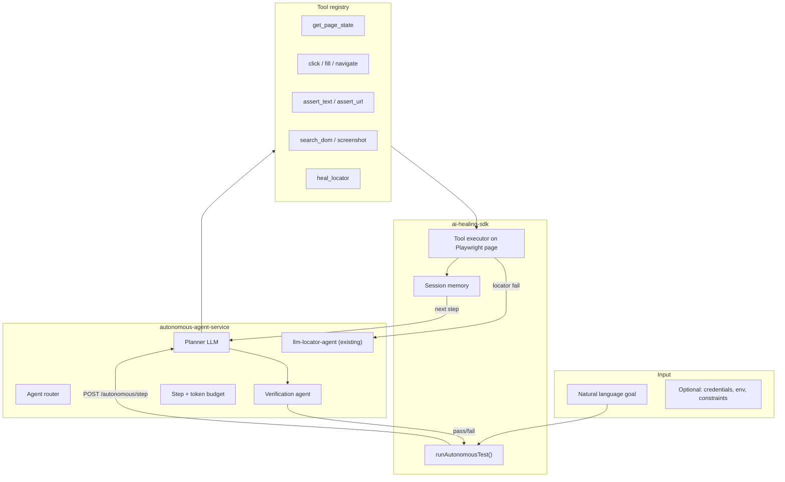

# PRD: Conversion to Fully Autonomous AI Test Agent

| Field | Value |
|-------|-------|
| **Document** | PRD-Fully-Autonomous-AI-Agent |
| **Version** | 1.0 |
| **Status** | Draft |
| **Last updated** | 2026-06-12 |
| **Builds on** | [PRD-Agentic-AI-Conversion.md](./PRD-Agentic-AI-Conversion.md) (Phases 4–7 complete/in progress) |

---

## 1. Executive summary

**Can we convert to a fully autonomous AI agent?**  
**Yes — but it is a new product layer**, not a configuration change. Today’s framework is an **autonomous locator-healing agent** inside **human-authored tests**. A **fully autonomous AI agent** owns the entire test execution: goal → plan → act → verify → replan → report — with minimal pre-written locators.

**Analogy**

| Today | Fully autonomous target |
|-------|-------------------------|
| Copilot fixes a broken sentence | Writer gives topic; AI writes the full article |
| GPS recalculates one wrong turn | Driver says destination; car drives |
| Heals locators in existing tests | Agent completes user journeys from goals |

**Recommended positioning if built:**  
*“Fully autonomous AI test agent for Playwright — goal-driven execution with self-healing, verification, and audit trail.”*

**Timeline estimate:** 6–12 months (3 major phases after current agentic foundation).

---

## 2. Definition: “Fully autonomous AI agent”

For this PRD, **fully autonomous** means:

| Capability | Required? | Today |
|------------|-----------|-------|
| Natural-language **test goal** as input | ✅ | ❌ |
| **Plans** multi-step actions without pre-written locators | ✅ | ❌ |
| **Executes** click, fill, navigate, wait via tools | ✅ | Partial (healing only) |
| **Verifies** outcomes (URL, text, element state) | ✅ | ❌ (human assertions) |
| **Replans** when an action fails | ✅ | Partial (locator loop only) |
| **Completes** goal or fails with explainable reason | ✅ | ❌ |
| **Bounded** steps, cost, time, domain | ✅ | Partial (3 heal iterations) |
| **Auditable** trace (tools, reasoning, screenshots) | ✅ | Partial |
| Optional: **maintains** test artifacts (code, tickets) | Phase 3 | ❌ |

**Not required for v1 “fully autonomous” (test execution scope):**

- Autonomous test **suite generation** from scratch for entire app
- Unsupervised production monitoring without guardrails
- Replacing human sign-off on release decisions

---

## 3. Gap analysis (current → full autonomy)

```
TODAY                          FULL AUTONOMY
─────────────────────────────────────────────────────────
Human writes test spec         Human writes GOAL only
Human writes locators          Agent discovers locators each run
Static strategies first        LLM planner drives actions
Heal on locator failure        Plan full journey from scratch
Single action recovery         Multi-step task completion
Optional LLM (healing only)    LLM required for planning (always-on)
Rules work offline             LLM + tools + memory required
```

**What we already have (reuse ~40%)**

- Agent loop pattern (`agent-loop.ts`)
- Tool pattern (`search_dom`, `list_heuristic_candidates`)
- `llm-provider` (OpenAI, Anthropic, mock)
- `healing-service` HTTP gateway
- DOM snapshot pipeline
- Playwright report attachments
- Plug-and-play SDK packaging

**What we must build (~60%)**

- Goal/spec contract and planner
- Full browser **action tool registry**
- Verification / assertion tools
- Session **memory** (action history, page state)
- Autonomous orchestrator (replaces test steps)
- Safety: domain allowlist, step budget, PII redaction
- Evaluation harness for autonomous runs
- New public API: `runAutonomousTest(page, goal)`

---

## 4. Target architecture



**Key design choice:** Autonomous agent **calls existing healing** as tool `heal_locator` — do not rewrite healing logic.

---

## 5. New public API (target)

```ts
import { test } from '@playwright/test';
import { runAutonomousTest } from 'ai-healing-sdk';

test('autonomous checkout', async ({ page }) => {
  const result = await runAutonomousTest(page, {
    goal: 'Log in as test@demo.com / password123, add first product to cart, reach checkout page.',
    maxSteps: 25,
    allowedDomains: ['retail-website-two.vercel.app'],
    llm: { provider: 'openai' }, // or service URL
  });

  expect(result.status).toBe('completed');
  expect(result.verification.passed).toBe(true);
  await attachAutonomousTrace(testInfo, result);
});
```

**Hybrid mode (migration path):** Existing `healable.*` tests keep working; autonomous tests are opt-in via `@autonomous` tag.

---

## 6. Tool registry (autonomous agent)

| Tool | Description | Phase |
|------|-------------|-------|
| `get_page_state` | URL, title, DOM summary, optional screenshot | 8 |
| `click` | LLM proposes locator → validate → click | 8 |
| `fill` | LLM proposes locator + value → fill | 8 |
| `navigate` | Go to URL | 8 |
| `wait_for` | Wait for URL/text/element | 8 |
| `assert_visible` | Verify element exists | 8 |
| `assert_url` | Verify URL pattern | 8 |
| `assert_text` | Verify text on page | 9 |
| `heal_locator` | Delegate to existing agent loop | 8 |
| `search_dom` | Existing tool | 8 |
| `read_console_errors` | Capture JS errors | 9 |
| `network_hint` | Last failed request summary | 10 |
| `complete_goal` | Agent signals done | 8 |
| `fail_goal` | Agent signals impossible + reason | 8 |

---

## 7. Phased delivery

### Phase 8 — Autonomous execution MVP (8–10 weeks)

**Goal:** One NL goal → agent completes Nova Retail login without pre-written locators.

| Deliverable | Location |
|-------------|----------|
| `packages/autonomous-agent-contracts` | Goal, Step, Trace types |
| `agents/autonomous-test-agent` | Planner + tool loop |
| `services/autonomous-agent-service` or extend `healing-service` | `POST /autonomous/run` |
| SDK: `runAutonomousTest()` | `packages/ai-healing-sdk/src/autonomous/` |
| Demo spec | `tests/autonomous-login.spec.ts` |
| Requires real LLM or rich mock | OpenAI default |

**Exit criteria**

- [ ] Goal: “Log in with test@demo.com / password123” completes on Nova Retail
- [ ] Max 25 steps enforced
- [ ] Full trace in Playwright report
- [ ] Uses `heal_locator` when click/fill fails

### Phase 9 — Verification & multi-step journeys (6–8 weeks)

**Goal:** Autonomous add-to-cart + reach checkout with assertions.

- Verification agent validates URL, headings, cart state
- Replans on assertion failure (not just locator failure)
- Evaluation set: 10 Nova Retail journeys

### Phase 10 — Production autonomy (8–12 weeks)

**Goal:** CI-safe autonomous suite with governance.

- Domain allowlist, secret injection via env (not prompts)
- Cost caps per run and per suite
- Human review for failed autonomous runs
- Dashboard KPIs: goal completion rate, avg steps, cost
- Optional: convert successful trace → generated Playwright spec

### Phase 11 — Maintenance agent (future)

- Autonomous locator persistence with PR review
- Jira/Linear ticket on repeated failure
- Not in initial “fully autonomous” v1 scope

---

## 8. LLM requirements (full autonomy)

Unlike healing (optional LLM), **full autonomy requires always-on LLM** for planning.

| Mode | Healing today | Full autonomy |
|------|---------------|---------------|
| Default | Heuristic, no key | **Not supported** — must use service + key or mock planner |
| CI | Mock/heuristic OK | Mock planner with scripted plans OR gated nightly real-LLM job |
| Production experiments | Optional | OpenAI/Anthropic required |

**Mock for CI:** `AutonomousMockPlanner` returns fixed plan for known goals (login, cart) — not true autonomy but enables pipeline.

---

## 9. Safety & governance

| Risk | Mitigation |
|------|------------|
| Agent clicks wrong button | Verification tools + domain scope + max steps |
| Runaway cost | Token + step budget per run |
| Credential leak | Secrets via env; never in prompts; redact in traces |
| Destructive actions | Block delete/pay/submit without explicit goal permission flag |
| Non-determinism | Same goal may differ run-to-run — document for stakeholders |
| False “pass” | Mandatory verification agent sign-off before `completed` |

**New env vars**

```
AUTONOMOUS_AGENT_ENABLED=1
AUTONOMOUS_MAX_STEPS=25
AUTONOMOUS_ALLOWED_DOMAINS=...
AUTONOMOUS_LLM_PROVIDER=openai
AUTONOMOUS_BUDGET_USD=1.00
AUTONOMOUS_REQUIRE_VERIFICATION=1
```

---

## 10. Success metrics

| Metric | Target (Phase 9) |
|--------|------------------|
| Goal completion rate (Nova Retail 10 journeys) | ≥ 70% |
| Avg steps to complete login | ≤ 12 |
| False pass rate | < 5% |
| P95 run latency | < 3 min |
| Cost per autonomous run | < $0.25 median |
| Human-authored tests still pass | 100% (unchanged) |

---

## 11. What we should NOT claim until Phase 10

- “Fully autonomous” without LLM + verification layer
- “Zero human test authoring” — v1 still needs goals and review
- “100% deterministic CI” — autonomous runs need eval harness
- Replacing all existing `healable` / page object tests immediately

---

## 12. Migration path (existing users)

```
Stage 0 (today)     → Human tests + healable / clickHealing
Stage 1 (Phase 8)   → Hybrid: 1–2 autonomous smoke goals + existing suite
Stage 2 (Phase 9)   → Autonomous for exploratory / staging journeys
Stage 3 (Phase 10)  → Autonomous nightly; human tests for release gate
```

**Do not deprecate** healing SDK APIs — autonomous agent is a **superset product mode**.

---

## 13. Effort summary

| Phase | Duration | Team | Outcome |
|-------|----------|------|---------|
| 8 — MVP | 8–10 wks | 2 engineers | Autonomous login |
| 9 — Verify | 6–8 wks | 2 engineers | Multi-step + assertions |
| 10 — Harden | 8–12 wks | 2–3 engineers | CI + governance |
| **Total** | **~6–12 months** | | **Presentable as fully autonomous AI agent** |

---

## 14. Decision: should we build it?

| If your goal is… | Recommendation |
|------------------|----------------|
| Present as “AI solution” today | Use **AI-enabled agentic healing** positioning (current) |
| Demo true autonomy in 2–3 months | **Start Phase 8** — autonomous login MVP |
| Enterprise “fully autonomous QA” | Full Phase 8–10 + evaluation + legal review |
| CI-only, no LLM cost | **Not full autonomy** — stay with current healing |

---

## 15. Immediate next step (if approved)

1. Approve Phase 8 scope (autonomous login only).
2. Spike `runAutonomousTest()` with 5 tools + OpenAI planner.
3. Demo video: goal text → agent logs in with zero locators in spec.
4. Update deck: “Roadmap: Fully Autonomous Agent — Phase 8”.

---

*End of PRD v1.0*
